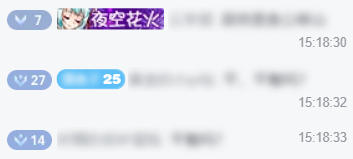
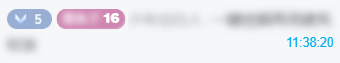
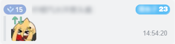
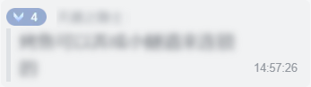

# Bilibili 直播弹幕发送时间显示

## 概述

在 Bilibili 直播间的弹幕列表中，为每条弹幕显示其发送时间。支持显示现实时间（本地时区）以及相对于直播开始的直播时间。

> 本脚本可与 [Bilibili直播评论样式修改 _v1.0.4+_](https://scriptcat.org/zh-CN/script-show-page/5757) 联动, 实现更结构化的时间显示. 

## 功能特性

- 现实时间显示：在每条弹幕末尾显示发送时的本地时间（格式 hh:mm:ss）
- 直播时间显示：鼠标悬停在弹幕上时，显示该弹幕发送时距离直播开始经过了多久（格式 hh:mm:ss）
- 自动适配样式：兼容 Bilibili 直播弹幕的原始样式以及 **Bilibili直播评论样式修改** 脚本的联动样式
- 精准时间解析：根据弹幕的 `timestamp` / `ts` 属性计算真实发送时间，兼容自己发送的弹幕

## 使用方法

1. 安装网页拓展 [脚本猫](https://scriptcat.org/zh-CN)
2. 在脚本详情页面点击 **安装脚本** 按钮
3. 进入任意 Bilibili 直播间（`https://live.bilibili.com/*`），脚本将自动生效

## 示例

**现实时间**

弹幕内容右侧会显示类似 `14:32:08` 的时间，表示该弹幕在 14 时 32 分 08 秒发送。

**直播时间**

将鼠标悬停在弹幕上，时间会自动切换为直播时长，显示为蓝色，例如 `00:15:42`，表示这条弹幕是在开播后 15 分 42 秒发送的。

---

**原始样式**





---

**联动样式**





## 许可证

[GPL-3](https://www.gnu.org/licenses/gpl-3.0.zh-cn.html)

## 问题反馈

如有问题或建议，请联系：

- 邮箱: aluibyiero@qq.com
- Github Issue: https://github.com/AliubYiero/Yiero_WebScripts/issues

**功能增加模板**

```
脚本名称: Bilibili 直播弹幕发送时间显示
脚本版本: [如 0.2.4]
需要的新功能:
[...]
```

**Bug 提交模板**

```
脚本名称: Bilibili 直播弹幕发送时间显示
脚本版本: [如 0.2.4]
使用的浏览器及其版本: [如 Google Chrome 版本 142.0.7444.61（正式版本） （64 位）]

出现的问题:
[...]

重现步骤:
1.
2.
3.

补充(如报错截图):
```
