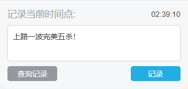
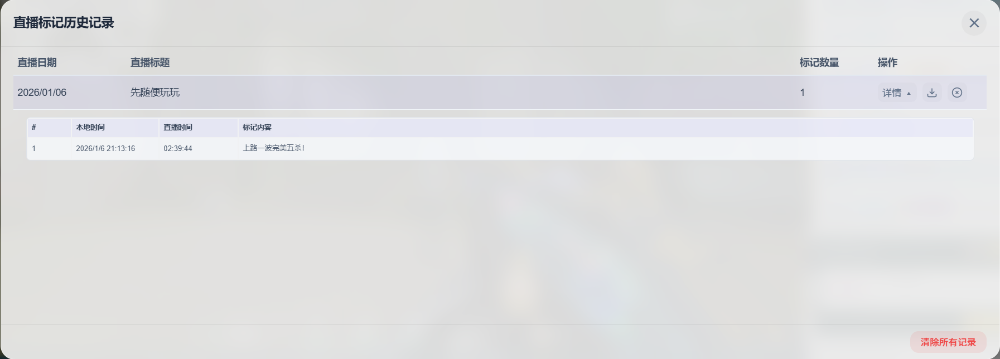

# Bilibili直播时间点标记 说明文档

## 概述

Bilibili直播时间点标记是一款专为B站直播设计的用户脚本。它能够在直播页面自动注入一个便捷的标记工具，帮助观众在观看直播时，快速记录下精彩或重要的时刻（时间点），并附上自定义的文字说明。所有记录的数据均保存在本地，并可按直播场次进行管理、浏览和导出，极大地提升了直播回顾、内容剪辑或笔记整理的效率。

## 功能特性

- **自动注入与初始化**：脚本在访问B站直播页面 (`live.bilibili.com/*`) 时自动运行，加载标记卡片并检查本地存储。
- **标记卡片**：提供一个始终可见的操作面板，包含：
    - **时间显示区**：动态显示当前本地时间与直播时间（基于页面计时器计算），在悬停或输入时切换显示。
    - **文本输入框**：用于输入当前时刻的标记说明。
    - **查询记录按钮**：用于呼出直播记录详情页面。
    - **记录按钮**：点击即可保存一条包含 `时间戳` 和 `说明` 的标记。
- **智能时间处理**：时间显示区在鼠标悬停或输入框获得焦点时会切换到直播时间，方便记录；输入时自动锁定时间，避免因时间流逝导致记录不准。
- **快捷键支持**：
    - 在未聚焦标记输入框时，可使用 `Alt+E` 快速聚焦到标记输入框。
    - 在标记输入框聚焦时，可使用 `Alt+E` 快速取消聚焦输入。
    - 在标记输入框聚焦时，可使用 `Ctrl+Enter` 键快速保存标记。

- **本地存储**：所有标记数据均实时保存到脚本存储的 `GM_Storage` 中，按不同的直播房间号和时间进行场次隔离，确保数据持久且独立。
- **历史记录管理**：提供历史记录查看功能，以弹窗（模态框）形式展示。
    - **场次列表**：按直播房间和日期列出所有记录过的直播场次。
    - **场次详情**：点击单个场次可查看该场直播中记录的所有时间点标记的详细信息列表。
- **数据导出**：在单场直播的详情页面，支持将该场次的所有标记记录一键导出为标准的JSON文件，方便备份或进行进一步处理。

## 使用方法

安装网页拓展 [脚本猫](https://scriptcat.org/zh-CN)，点击脚本详情页面的 **安装脚本** 按钮。

1.  正常进入任意一个Bilibili直播房间。
2.  页面加载完成后，页面右下角弹幕输入框的下面将出现一个标记卡片。
3.  **记录标记**：在输入框中输入你想记录的内容（如“精彩操作！”），然后点击“记录”按钮或直接按 `Ctrl+Enter` 键即可保存。
4.  **查看历史**：点击卡片上的*查询记录按钮*按钮（具体位置请参考脚本实际UI）打开历史记录弹窗，浏览或管理过往标记。
5.  **导出数据**：在历史记录弹窗中，进入某个直播场次的详情页，找到“下载”按钮即可下载JSON文件。

## 示例
### 基础示例
假设你正在观看一场游戏直播，主播完成了一次“五杀”操作。
1.  你立刻在脚本的悬浮输入框中输入：“上路一波完美五杀！”。
2.  按下 `Ctrl+Enter` 键。
3.  一条包含当前直播精确时间点（例如：开播后 `01:23:45`）和说明文字的标记就被保存下来了。直播结束后，你可以通过历史记录快速定位到这个高光时刻。

### 高级示例
**场景：录制学习直播的重点**
你正在观看一个编程教学直播，需要记录下多个知识点的时间点以便后期复习。

1.  **章节开始**：直播开始时，记录“开场与课程介绍”。
2.  **知识点标记**：每当讲师开始讲解一个新概念（如“讲解闭包原理”）、演示一个关键代码片段（如“实现XXX功能的代码演示”）或解答一个重要问题时，你都可以快速输入简短的描述并保存。
3.  **互动与问答**：当直播间进入有价值的问答环节时，记录“Q&A环节开始”。
4.  **直播结束**：记录“直播结束与总结”。
5.  **回顾与整理**：直播结束后，打开历史记录，进入本场直播的详情页。你可以清晰看到按时间排序的所有知识点标记列表。你可以直接根据这些时间点去回看录播视频进行复习，或者点击“导出”按钮，将整个列表以JSON格式导出，用于制作自己的学习笔记时间轴。

## 许可证

[GPL-3](https://www.gnu.org/licenses/gpl-3.0.zh-cn.html)

## 技术支持

如有问题或建议，请联系：
- 邮箱: aluibyiero@qq.com
